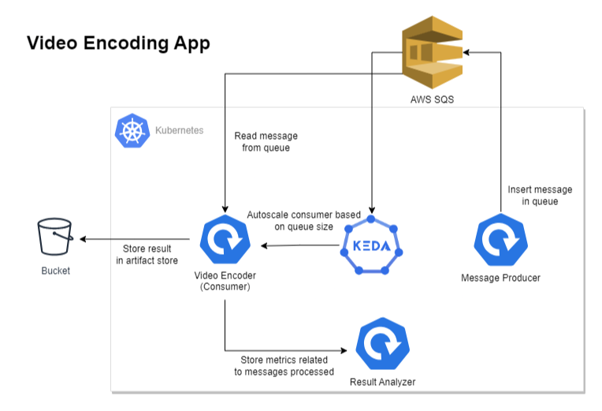

# KEDA’s dynamic scheduling fixes Kubernetes long-running workloads

Kubernetes has become the de facto standard for deploying microservices, owing to its autoscaling and self-healing capabilities. By default, it provides HPA and VPA for scaling applications based on CPU and RAM metrics.
Using these components is a great starting point and works well for applications under uniform load. However, in today’s cloud-native ecosystem, scaling solely on CPU and memory utilization against dynamic traffic patterns and fluctuating workloads is inadequate. This is where the native autoscaling features of Kubernetes fall short.
To accommodate such unpredictable behavior, we require metrics that adjust in real-time and closely reflect application behavior. 

For example
- Event-Driven Applications: Consider a AWS SQS driven setup. While CPU usage might remain stable, a surge in incoming AWS SQS messages is the real metric that determines load. In such a case, autoscaling should ideally respond to the rate of incoming events or the message backlog.
- E-Commerce Transactions: In an e-commerce framework, special sale events might see a spike in order checkouts. The CPU might be unperturbed, but the genuine load can be accumulating unprocessed orders in a database queue.

These metrics offer a more responsive approach to autoscaling compared to just CPU and RAM. In this blog, we’ll explore configuring autoscaling for event-driven applications using AWS SQS with KEDA, and also checkout various authentication techniques and additional AWS metrics supported by KEDA for autoscaling.

For foundational understanding about KEDA, refer to this blog post.


# Architecture


# Directory Structure

```
.
├── commands.sh                    # Contains utility commands
├── images                         # Directory for storing images related to the blog or documentation.
├── keda-operator-policy.json         # IAM policy for KEDA operator, granting necessary permissions for autoscaling.
├── keda-operator-trust-policy.json   # Trust policy for KEDA operator, defining trust relationships.
├── sqs-full-access-policy.json       # Policy granting full access to SQS, used for components interacting with SQS.
└── trust-policy.json                 # General trust policy, for IAM roles or other AWS services.
├── producer.yaml              # Kubernetes job configuration for message production, for SQS.
├── result-analzyer.yaml       # Kubernetes deployment for the result analyzer, analyzing message processing results.
├── scaled-job-consumer.yaml   # KEDA configuration for autoscaled consuming jobs, managing workload based on SQS queue length.
├── service-account.yaml       # Kubernetes service account, likely for authentication within the cluster.
└── readme.md                  # Documentation or instructions related to Kubernetes configurations.
```