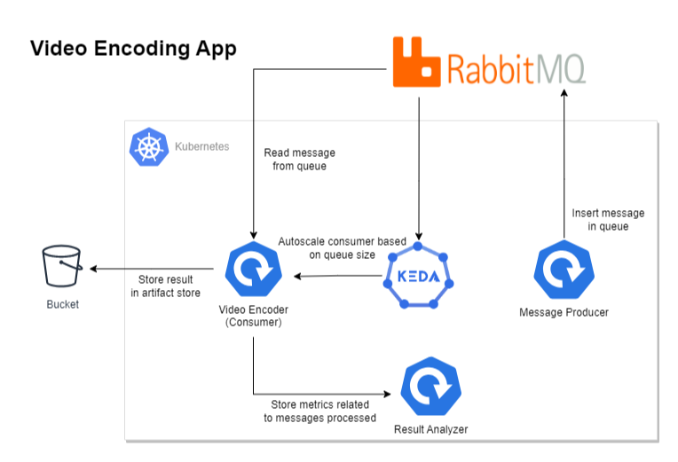

# KEDA’s dynamic scheduling fixes Kubernetes long-running workloads

When people talk about autoscaling, most of the time it is about scaling up, but have you asked yourself, what is the impact of scaling on different types of applications?
Let’s say you have written an API or a Job that takes a significant amount of time to get the work done and this application is configured with autoscaling in Kubernetes.
Scaling up is effortless, no problems there. But when Kubernetes instructs to scale in the application, what happens to the long-running process inside the container? If it gets killed, what about the inefficiency (processing cycles wasted) introduced with the enablement of auto-scaling?
These are some inherent problems of autoscaling that KEDA solves. In this blog post, we will show how KEDA not only enables event-driven autoscaling but also handles the intricacies associated with autoscaling.


# Architecture


# Directory Structure

```
│   # Contains kubernetes job that use streamdal/plumber cli to generate messages in rabbitmq
│   # Not used in the blog post
├── cli-producer-program
│  
│   # Contains kubernetes deployment that uses amqp-consume cli to read message from rabbitmq
├── cli-consumer-program
│
│   # Contains kubernetes deployment & python script that uses pika library to read message from rabbitmq
│   # Not used in the blog post
├── python-consumer-program
│
│   # Contains kubernetes job & python script that uses pika library to generate messages in rabbitmq
│   # The script also create the required rabbitmq exchange and queue for the blog post
├── python-producer-program
│
│   # Contains kubernetes deployment & python script that expose some rest APIs
│   # To understand the autoscaling behavior, this component exposes some REST APIs that are consumed by the consumer application.
|   # It essentially keeps track of events that occurred while processing the message.
├── result-analyzer-program
│
│   # Contains json results for different test scenarios
├── results
│
│   # Contain rabbitmq operator cluster config
├── rabbitmq_cluster.yaml
│
│   # Contain KEDA scaled job with amqp protocol config
├── rabbitmq_scaled_job_amqp.yaml
│
│   # Contain KEDA scaled object with amqp protocol config
├── rabbitmq_scaled_object_amqp.yaml
|
│   # Contain KEDA scaled object with http protocol config
│   # Not used in the blog post
├── rabbitmq_scaled_object_http.yaml
```