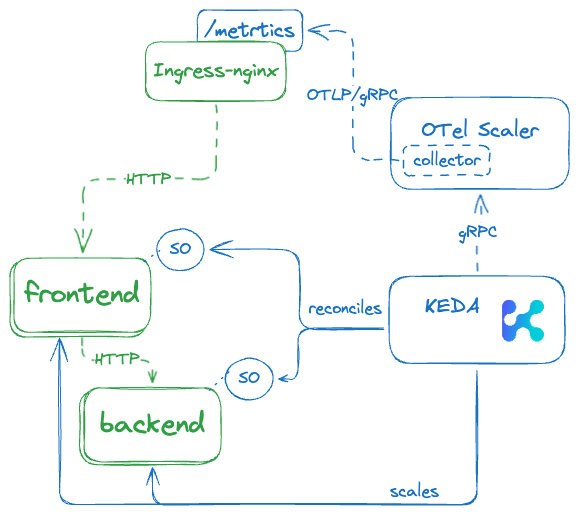

# Setup
1. install the Apollo Router backend

```
helm upgrade --install my-app-be \
   --namespace app \
   --create-namespace \
   oci://ghcr.io/apollographql/helm-charts/router \
   -f ./apollo-values.yaml
```

2. expose the ingress-nginx metrics endpoint

```
helm upgrade --install ingress-nginx ingress-nginx \
   --repo https://kubernetes.github.io/ingress-nginx \
   --reuse-values \
   --namespace ingress-nginx \
   --create-namespace \
   --set controller.metrics.enabled=true
```

3. install the OTel Scaler

```
helm upgrade --install keda-otel-scaler \
   --namespace keda \
   --create-namespace \
   oci://ghcr.io/kedify/charts/otel-add-on \
   --version=v0.1.3 \
   -f ./otel-scaler-values.yaml
```

4. create the demo app and ScaledObjects

```
kubectl apply -f fe.yaml -f be-so.yaml -f fe-so.yaml
```

# Architecture


[Source diagram](https://excalidraw.com/#json=VzaunOMs2NXOd_rTVy2yl,RU1vtVumsMIw-PxaUETKKw)
