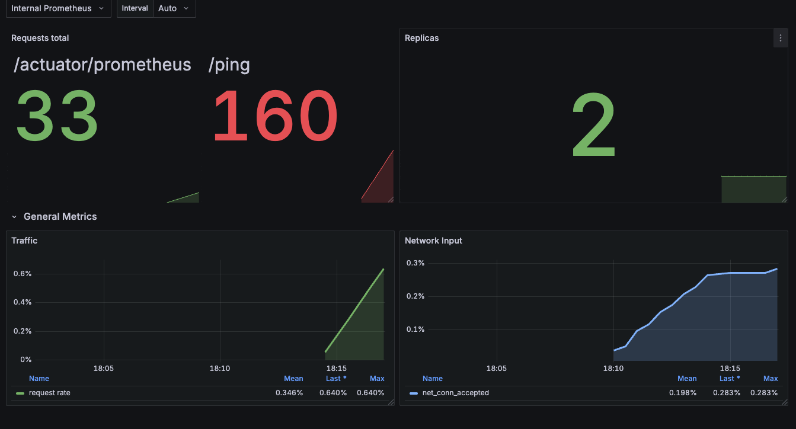

## KEDA OTel Scaler Setup with TLS and Router OTel collector

This example demonstrates a complex setup where one metric (let's call it `metric_x`) can be routed to KEDA Scaler and while all the other signals (including the `metric_x`) can be routed to the original destination as usual.

This pattern is because it prevents the security/data breach and sends only the minimal portion of telemetry data that KEDA is interested in.

There are two examples:
- scraping/pull - Demo Spring Boot app exposes metrics on `:8080/actuator/prometheus` and Router OTel collector periodically scrape these endpoints
- OTLP/push - Router OTel just listens and it's the workload app's responsibility to push the metrics using OTLP over gRPC


## scraping/pull

Architecture:



To bootstrap this scenario just run:

```bash
./setup-springboot-pull.sh
```


## OTLP/push

Architecture:



To bootstrap this scenario just run:

```bash
./setup-springboot-push.sh
```

## Description

Both scenarios deploys:
 - a sample application written in Spring Boot (client and server)
 - OTel collector called router
 - Prometheus and Grafana representing the existing monitoring infrastructure - top path on both diagrams w/ architecture
 - and finally KEDA and KEDA OTel scaler
 - cert manager and all the certs for each component, certs are rotated each hour

For each scenario, there is also a Grafana dashboard and once the script finishes it prints command that can be used for simulating the traffic spikes and scaling based on custom metrics.

In general you can continue with:

```bash
# create traffic
(hey -z 30s http://localhost:8080/ping &> /dev/null)&

# check how it scales out
k get hpa -A && k get so -A
```

And observe the dashboard (available at `http://localhost:8082/dashboards`):


