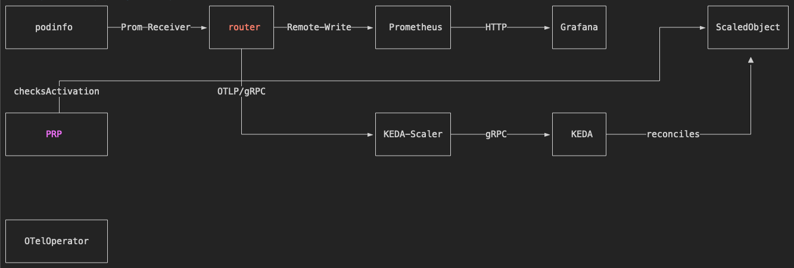
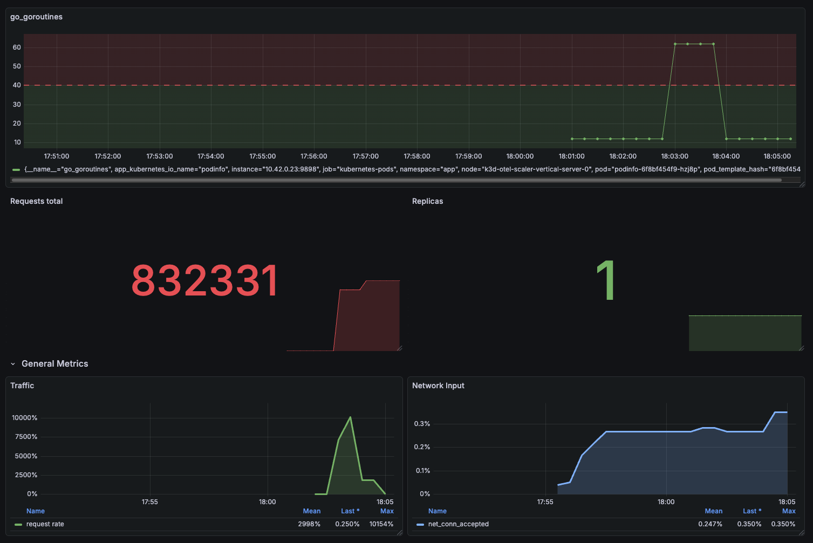

## KEDA OTel Scaler Setup with Router OTel Collector and Kedify PodResourceProfile (Vertical Autoscaling)

This example demonstrates a complex setup where one metric (in our example it's number of go routines) can be routed to the KEDA Scaler, while all other signals (including the one used for scaling) are routed to the existing backend as usual.

This pattern prevents security/data breaches and sends only the minimal portion of telemetry data that KEDA needs.

The `ScaledObject` used for scaling the `podinfo` doesn't change the number of replicas because it has `minReplicaCount == maxReplicaCount == 1` but instead, it becomes `Active` or `Passive` based on the fact if `go_goroutines` is higher than `40` or lower.

Then PodResourceProfile resource make sure the pod gets higher memory or lower.

`ScaledObject`:

```yaml
apiVersion: keda.sh/v1alpha1
kind: ScaledObject
metadata:
  name: podinfo
  namespace: app
spec:
  scaleTargetRef:
    name: podinfo
  triggers:
    - type: kedify-otel
      metadata:
        scalerAddress: "kedify-otel-scaler.keda.svc:4318"
        metricQuery: "go_goroutines"
        targetValue: "40"
  minReplicaCount: 1
  maxReplicaCount: 1
```
([source](./so-podinfo.yaml))

`PodResourceProfile`:

```yaml
apiVersion: keda.kedify.io/v1alpha1
kind: PodResourceProfile
metadata:
  name: podinfo
  namespace: app
spec:
  containerName: podinfo
  newResources:
    requests:
      memory: 50M
  paused: false
  priority: 0
  target:
    kind: scaledobject
    name: podinfo
  trigger:
    after: activated
    delay: 0s
```
([source](./prp-podinfo.yaml))

## Architecture

Architecture:



To bootstrap this scenario, just run:

```bash
export KEDIFY_API_KEY=kfy_**
export KEDIFY_ORG_ID=**
# to get those ^ check https://docs.kedify.io/installation/helm

# run the setup script
./setup.sh
```

## Description

This scenario deploys:
 - a sample webapp application called Podinfo written in Golang exposing the metrics endpoint
 - OTel collector called router
 - Prometheus and Grafana representing the existing monitoring infrastructure - top path on the diagram of the architecture
 - Kedify Agent, KEDA and OTel Scaler

There is also a Grafana dashboard, and once the setup script finishes, it prints a command that can be used for simulating traffic spikes and scaling based on custom metrics.

In general you can continue with:

```bash
# check metric predictors
k get mp -owide -A

# check collector
k get otelcol -A

# create traffic
(kubectl port-forward -napp svc/podinfo 9898 &> /dev/null)& pi_pid=$!
(sleep 10m && kill ${pi_pid})&
(hey -z 30s http://localhost:9898 &> /dev/null)&

# check the # of go_goroutines
curl http://localhost:9898/metrics | grep go_goroutines

# check how it scales up and down
watch "kubectl get po -napp -lapp.kubernetes.io/name=podinfo -ojsonpath=\"{.items[*].spec.containers[?(.name=='podinfo')].resources}\" | jq"
```

> [!TIP]
> ```
> (kubectl port-forward -nobservability svc/grafana 8082:80 &> /dev/null)& pg_pid=$!
> (sleep 10m && kill ${pg_pid})&
> ```
> And observe the dashboard (available at `http://localhost:8082/dashboards`):
> 

## Asciinema Recording
[](https://asciinema.org/a/780536)
