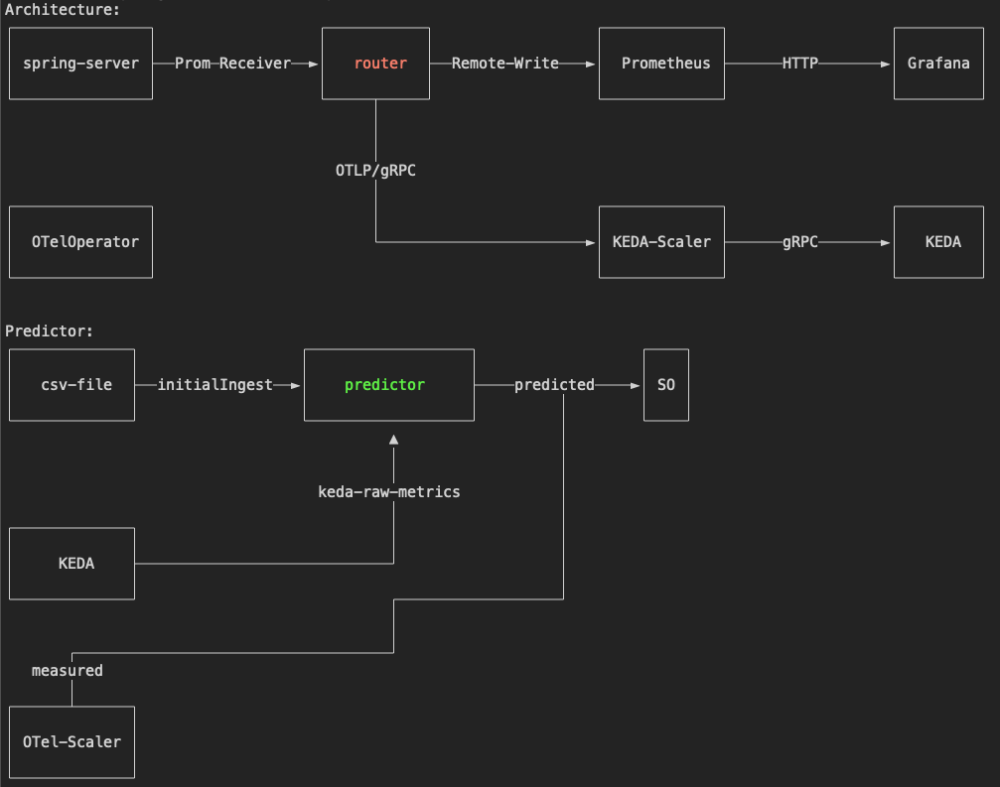
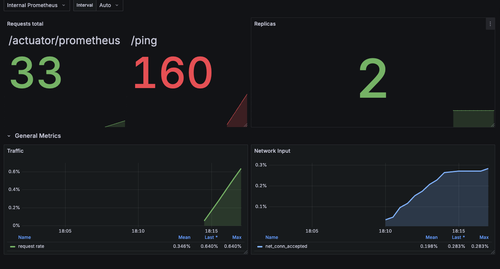

## KEDA OTel Scaler Setup with Router OTel Collector and Kedify Predictor

This example demonstrates a complex setup where one metric (let's call it `metric_x`) can be routed to the KEDA Scaler, while all other signals (including `metric_x`) are routed to the existing backend as usual.

This pattern prevents security/data breaches and sends only the minimal portion of telemetry data that KEDA needs.

`metric_x` is also periodically sent to Kedify Predictor using KEDA's `raw-metric` gRPC service. Predictor stores it in its database and runs training jobs on the new metric data to perform continuous learning.

The `ScaledObject` used for scaling the `spring-server` then uses both the measured value of incoming HTTP requests to the `/ping` endpoint and the predicted value from the predictor's ML model.

`ScaledObject`:

```yaml
apiVersion: keda.sh/v1alpha1
kind: ScaledObject
metadata:
  name: spring-server
  namespace: app
spec:
  scaleTargetRef:
    name: spring-server
  triggers:
    # this trigger works on real OpenTelemetry metrics that are being measured live
    - type: kedify-otel
      name: measured
      metadata:
        scalerAddress: "keda-otel-scaler.keda.svc:4318"
        metricQuery: "sum(http_server_requests_seconds_count{method=GET,outcome=SUCCESS,status=200,uri=/ping})"
        targetValue: "400"
    # this trigger works on data predicted by a model that is being fed with real OTel metrics, but predicts the value 10 minutes into the future
    - type: kedify-predictive
      name: predicted
      metadata:
        modelName: app-in-ten
        targetValue: "400"
  advanced:
    scalingModifiers:
      # 70% weight on the measured value, 30% weight on the predicted value
      formula: "(0.7 * measured) + (0.3 * predicted)"
      target: "400"
      metricType: "AverageValue"
```
([source](./so-springboot.yaml))


## Architecture

Architecture:



To bootstrap this scenario, just run:

```bash
export KEDIFY_API_KEY=kfy_**
export KEDIFY_ORG_ID=**
# to get those ^ check https://docs.kedify.io/installation/helm

# run the setup script
./setup-springboot.sh
```


## Description

This scenario deploys:
 - a sample application written in Spring Boot (client and server)
 - OTel collector called router
 - Prometheus and Grafana representing the existing monitoring infrastructure - top path on the diagram of the architecture
 - Kedify Agent, KEDA, OTel Scaler and Kedify Predictor
 - the ML model requires at least 1800 metric samples in order to train itself. We provide a CSV file that will bootstrap the ML model with initial data. Another option is to have the Predictor record real data and train once it has enough samples

There is also a Grafana dashboard, and once the setup script finishes, it prints a command that can be used for simulating traffic spikes and scaling based on custom metrics.

In general you can continue with:

```bash
# check metric predictors
k get mp -owide -A

# check collector
k get otelcol -A

# create traffic
(hey -z 30s http://localhost:8080/ping &> /dev/null)&

# check how it scales out
k get hpa -A && k get so -A
```

And observe the dashboard (available at `http://localhost:8082/dashboards`):



## Asciinema Recording
[](https://asciinema.org/a/780536)
