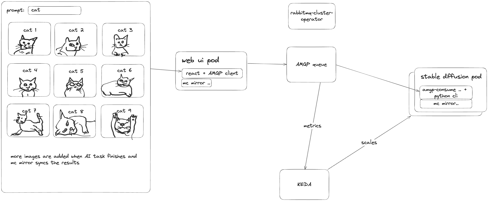

## Stable Diffusion use-case


https://excalidraw.com/#json=p1f9nzyFye_sOgnV9AmIL,69oUi00h3HKXnsyzUReA5g

The architecture is based on the job queue design pattern where webui app is responsible for feeding the queue called `tasks` with
job requests. Then KEDA spawns worker pods (either jobs or scales the corresponding deployment) which take the top job from the message queue
and start generating the image(s).

Images are delivered from the worker pods back to webui pod using Minio shared storage. Both worker pod and webui pod runs the minio sync utility as a side-car container.

### Worker

We ship the upstream project `fastsdcpu` as a container image. It's a python application that can operationalize some models from Hugging Face. It contains also a CLI that 
our wrapper bash [script](./tweaks/consumer.sh) is calling. So the script is responsible for waiting for a new message using `amqp-consume` tool (also present on the container image)
and passing the arguments to the CLI.

### WebUI
For more details consult its own dedicated [README.md](./webui/README.md)

### Try the container image locally

```
make build-image
PROMPT="cartoon dwarf" NUM_IMAGES=7 make run-example
```

### Try the local k8s setup

This requires `k3d` binary to be present on the `$PATH` and also the GPU support is turned off.

```
GPU="" make deploy-from-scratch
```

### Deploy to K8s

```
make deploy
```

This deploys Minio, RabbitMQ and web ui that can send request for image generation to the job queue.

From now you can continue either with a `scaledobject` approach or with `scaledjob` approach.

#### Deploy scaledjob or scaledobject

```
make deploy-scaledjob
```

XOR

```
make deploy-scaledobject
```

When using the `scaledjob` approach, the new kubernetes jobs are being created if the message queue is not empty and each job can process exactly one request from
the job queue. Once it generates the image, its side-car container with minio will sync the result (image and metadata file) to a shared filesystem and pod with job is terminated.

On the other hand, with scaledobject approach, normal Kubernetes deployment is being used for worker pods and these run the infinite loop where they process one job request
after another. The deployment is still subject of KEDA autoscaling so if there are no more pending messages in the job queue, the deployment is scaled to min replicas (`0`).


## Common Pain Points

### Container images are too large

Reasons:
- the models are too large (~4 gigs)
- python

Mitigation:
- pre-fetch or even bake the container images on a newly spawned k8s nodes

### GPUs being too expensive
- https://cloud.google.com/spot-vms/pricing#gpu_pricing

Mitigation:
- use node pool that can scale the number of GPU enabled nodes to zero replicas. This on the other hand ends up with significant delay if there are no GPU enabled k8s nodes and user
is waiting for their creation (installation of nvidia drivers).


### Example GKE Setup

<details>
  <summary>two-nodes conventional k8s cluster with a GPU based elastic node pool</summary>
  
```
gcloud -q beta container clusters delete use-cases --zone us-east4-a --project "kedify-initial" --async
gcloud beta container --project "kedify-initial" clusters create "use-cases" \
   --no-enable-basic-auth \
   --cluster-version "1.28.8-gke.1095000" \
   --release-channel "regular" \
   --machine-type "e2-medium" \
   --image-type "COS_CONTAINERD" \
   --disk-type "pd-balanced" \
   --disk-size "100" \
   --metadata disable-legacy-endpoints=true \
   --spot \
   --num-nodes "2" \
   --logging=SYSTEM,WORKLOAD \
   --monitoring=SYSTEM \
   --enable-ip-alias \
   --network "projects/kedify-initial/global/networks/default" \
   --subnetwork "projects/kedify-initial/regions/us-east4/subnetworks/default" \
   --no-enable-intra-node-visibility \
   --default-max-pods-per-node "110" \
   --security-posture=disabled \
   --workload-vulnerability-scanning=disabled \
   --no-enable-master-authorized-networks \
   --addons HttpLoadBalancing,GcePersistentDiskCsiDriver \
   --enable-autoupgrade \
   --enable-autorepair \
   --max-surge-upgrade 1 \
   --max-unavailable-upgrade 0 \
   --binauthz-evaluation-mode=DISABLED \
   --no-enable-managed-prometheus \
   --node-locations "us-east4-a"

# https://cloud.google.com/kubernetes-engine/docs/how-to/gpus#create-gpu-pool-auto-drivers
gcloud beta container \
   --project "kedify-initial" node-pools create "gpu-pool" \
   --cluster "use-cases" \
   --machine-type "n1-standard-4" \
   --accelerator "type=nvidia-l4,count=1" \
   --image-type "UBUNTU_CONTAINERD" \
   --disk-type "pd-balanced" \
   --disk-size "150" \
   --metadata disable-legacy-endpoints=true \
   --node-taints nvidia.com/gpu=present:NoSchedule \
   --service-account "kedify-initial@kedify-initial.iam.gserviceaccount.com" \
   --spot \
   --num-nodes "1" \
   --enable-autoscaling \
   --total-min-nodes "1" \
   --total-max-nodes "2" \
   --scale-down-unneeded-time=1800s \
   --scan-interval=10s \
   --location-policy "ANY" \
   --max-surge-upgrade 0 \
   --max-unavailable-upgrade 1 \
   --max-pods-per-node "110" \
   --tags=nvidia-ingress-all \
   --node-locations "us-east4-a"

gcloud container clusters update use-cases \
   --project "kedify-initial" \
   --zone us-east4-a \
   --enable-autoprovisioning \
   --min-cpu=1 --max-cpu=6 --min-memory=1 --max-memory=16 \
   --autoprovisioning-scopes=https://www.googleapis.com/auth/logging.write,https://www.googleapis.com/auth/monitoring,https://www.googleapis.com/auth/devstorage.read_only,https://www.googleapis.com/auth/compute

# login
gcloud container clusters get-credentials use-cases --zone us-east4-a --project kedify-initial
```
</details>

<details>
  <summary>1-node cluster with GPU enabled node</summary>
  
```
gcloud -q beta container clusters delete use-cases-single-node --zone us-east4-a --project "kedify-initial" --async
gcloud beta container clusters create use-cases-single-node \
  --project "kedify-initial" \
  --zone us-east4-a \
  --release-channel "regular" \
  --machine-type "n1-standard-4" \
  --accelerator "type=nvidia-tesla-t4,count=1,gpu-driver-version=default" \
  --image-type "UBUNTU_CONTAINERD" \
  --disk-type "pd-standard" \
  --disk-size "300" \
  --metadata disable-legacy-endpoints=true \
  --service-account "kedify-initial@kedify-initial.iam.gserviceaccount.com" \
  --spot \
  --no-enable-intra-node-visibility \
  --max-pods-per-node "110" \
  --num-nodes "1" \
  --logging=SYSTEM,WORKLOAD \
  --monitoring=SYSTEM \
  --enable-ip-alias \
  --security-posture=disabled \
  --workload-vulnerability-scanning=disabled \
  --no-enable-managed-prometheus \
  --no-enable-intra-node-visibility \
  --default-max-pods-per-node "110" \
  --no-enable-master-authorized-networks \
  --tags=nvidia-ingress-all

gcloud container clusters update use-cases-single-node \
  --project "kedify-initial" \
  --zone us-east4-a \
  --enable-autoprovisioning \
  --min-cpu=1 --max-cpu=6 --min-memory=1 --max-memory=16 \
  --autoprovisioning-scopes=https://www.googleapis.com/auth/logging.write,https://www.googleapis.com/auth/monitoring,https://www.googleapis.com/auth/devstorage.read_only,https://www.googleapis.com/auth/compute


# login
gcloud container clusters get-credentials use-cases-single-node --zone us-east4-a --project kedify-initial
```
</details>


## Non GCP environments or bare-metal K8s clusters

In case the nvidia drivers are not being managed by the cloud provider, one has to install the GPU operator:

```
kubectl create ns gpu-operator
kubectl label --overwrite ns gpu-operator pod-security.kubernetes.io/enforce=privileged
cat <<EOF | kubectl apply -f -
apiVersion: v1
kind: ResourceQuota
metadata:
  name: gpu-operator-quota
  namespace: gpu-operator
spec:
  hard:
    pods: 100
  scopeSelector:
    matchExpressions:
    - operator: In
      scopeName: PriorityClass
      values:
        - system-node-critical
        - system-cluster-critical
EOF

helm upgrade --install gpu-operator \
  -n gpu-operator \
  --create-namespace \
  nvidia/gpu-operator


# test that cuda is installed
cat <<EOF | kubectl apply -f -
apiVersion: v1
kind: Pod
metadata:
  name: cuda-vectoradd
spec:
  restartPolicy: OnFailure
  containers:
  - name: cuda-vectoradd
    image: "nvcr.io/nvidia/k8s/cuda-sample:vectoradd-cuda11.7.1-ubuntu20.04"
    resources:
      limits:
        nvidia.com/gpu: 1
EOF
```

## Image Data & Minio

The images and metadata JSON files are stored in `shared/images` virtual fs. One can see the content by

```
kubectl exec -ti deployments/stable-diffusion-webui -n stable-diff -c minio-sidecar -- mc ls shared/images
[2024-05-31 07:27:49 UTC] 405KiB STANDARD 08d90897-1b75-4f10-bd79-7fd341c7b6f8-1.png
[2024-05-31 07:27:49 UTC] 404KiB STANDARD 08d90897-1b75-4f10-bd79-7fd341c7b6f8-2.png
[2024-05-31 07:27:49 UTC] 387KiB STANDARD 08d90897-1b75-4f10-bd79-7fd341c7b6f8-3.png
[2024-05-31 07:27:49 UTC] 394KiB STANDARD 08d90897-1b75-4f10-bd79-7fd341c7b6f8-4.png
[2024-05-31 07:27:49 UTC]   830B STANDARD 08d90897-1b75-4f10-bd79-7fd341c7b6f8.json
[2024-05-31 07:30:11 UTC] 430KiB STANDARD 10a0f914-f6df-4481-9c91-519eb6357bb6-1.png
[2024-05-31 07:30:11 UTC] 431KiB STANDARD 10a0f914-f6df-4481-9c91-519eb6357bb6-2.png
[2024-05-31 07:30:11 UTC] 464KiB STANDARD 10a0f914-f6df-4481-9c91-519eb6357bb6-3.png
[2024-05-31 07:30:11 UTC] 385KiB STANDARD 10a0f914-f6df-4481-9c91-519eb6357bb6-4.png
[2024-05-31 07:30:11 UTC]   832B STANDARD 10a0f914-f6df-4481-9c91-519eb6357bb6.json
...
```

or delete old or new images:
```
kubectl exec -ti deployments/stable-diffusion-webui -n stable-diff -c minio-sidecar -- mc rm --recursive --force --older-than 2h shared/images
kubectl exec -ti deployments/stable-diffusion-webui -n stable-diff -c minio-sidecar -- mc rm --recursive --force --newer-than 10m shared/images
```

However, even if the images are deleted from the `shared/images`, they will still be present on the webui's pod. Because they have been already synced.
They can be removed by a pod restart or by executing shell on that pod and removing them manually:

```
kubectl exec -ti deployments/stable-diffusion-webui -n stable-diff -c minio-sidecar -- bash
bash-5.1# cd /images
bash-5.1# ls
08d90897-1b75-4f10-bd79-7fd341c7b6f8-1.png  10a0f914-f6df-4481-9c91-519eb6357bb6-3.png ...
```
